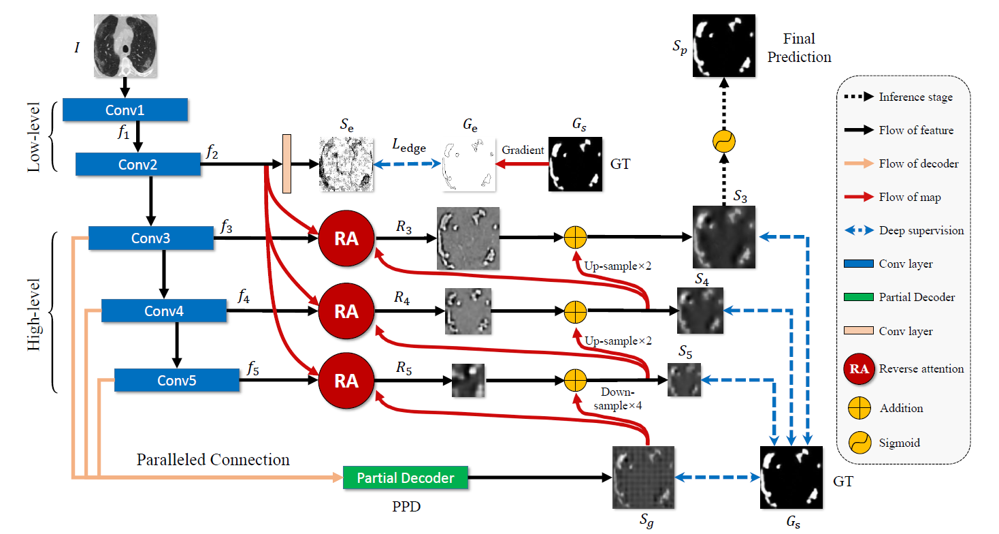
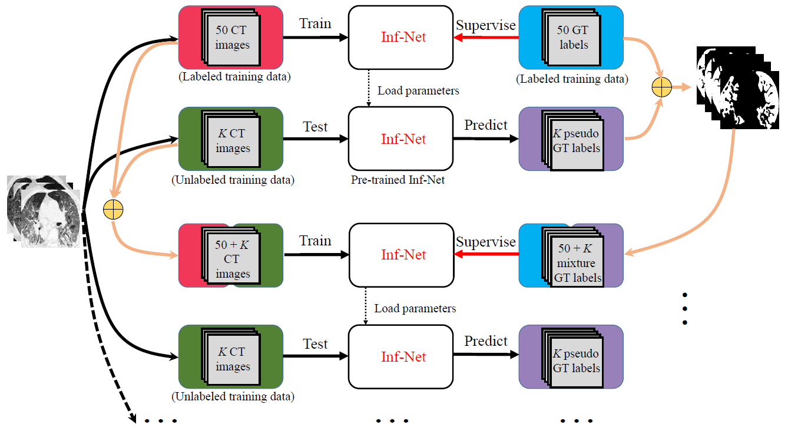
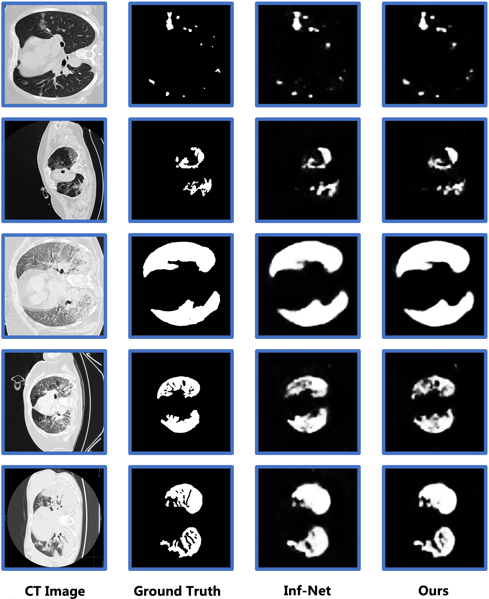

> **Warning**
> This repository is only used to be the code implementation of `Smart Medical` course project.

# 1.Introduction
## 1.1.Task Descriptions
<p align="center">
     <br />
    <em> 
    Figure 1. Example of COVID-19 infected regions in CT axial slice, where the red and green masks denote the 
    ground-glass opacity (GGO) and consolidation, respectively. The images are collected from [1].
    </em>
</p>
This project is desinged for COVID-19 CT segmentation task[1] and based on Inf-Net[2]. To overcome the scarcity of labeled CT images, we introduce a semi-supervised learning scheme to benifit from more accessible unlabeled data.

> [1] COVID-19 CT segmentation dataset, link: https://medicalsegmentation.com/covid19/, accessed: 2023-06-06.
> [2] Inf-Net: Automatic COVID-19 Lung Infection Segmentation from CT Images, TMI-2020

## 1.2.Inf-Net
<p align="center">
     <br />
    <em> 
    Figure 2. The architecture of Inf-Net.
    </em>
</p>
Inf-Net is a powerful network elaborately designed for COVID-19 CT segmentation.

## 1.3.Semi-supervised learning strategy
<p align="center">
     <br />
    <em> 
    Figure 3. Overview of the proposed Semi-supervised Inf-Net framework.
    </em>
</p>

To empower Inf-Net with a vast amount of unlabeled lung CT images, we employ a semi-supervised learning strategy. Specifically, Inf-Net is initially trained using half of the labeled CT images. Afterwards, the pre-trained Inf-Net infers pseudo labels for the remaining unlabeled training data. These ground truth labels and pseudo labels are subsequently utilized to further train the pre-trained Inf-Net. This iterative process continues until the segmentation loss converges.

# 2.Usage
## 2.1.Prerequisite
### 2.1.1 Install Required Packages
+ python >= 3.8
+ torch >= 1.10
+ torchvision

The required packages can be installed in the following way:
```shell
# A cuda version of torch is recommended
pip install torch torchvision torchaudio
pip install -r requirements.txt
```

### 2.1.2.Download Raw Data & Pretrained Model
+ Main task dataset:
  + Description: 100 labelled CT scans from the COVID-19 CT Segmentation dataset [1].
  + URL: CT volumes[[tr_im.nii.gz](https://drive.google.com/file/d/1SJoMelgRqb0EuqlTuq6dxBWf2j9Kno8S/view?usp=sharing)], Mask volumes[[tr_mask.nii.gz](https://drive.google.com/open?id=1MEqpbpwXjrLrH42DqDygWeSkDq0bi92f)].
  + Location: Put both files `tr_im.nii.gz` and `tr_im.nii.gz` into `Dataset/`
+ Unlabeled dataset:
  + Description: 1600 unlabeled images from the COVID-19 CT Collection dataset [2].
  + URL: Unlabeled CT volumes [[volumes](https://academictorrents.com/details/136ffddd0959108becb2b3a86630bec049fcb0ff)]
  + Location: Put folder `volumes` into `Dataset/`
+ Pretrained res50:
  + Description: ImageNet Pre-trained ResNet50
  + URL: [res50](https://shanghuagao.oss-cn-beijing.aliyuncs.com/res2net/res2net50_v1b_26w_4s-3cf99910.pth)
  + Location: Put file `res*.pt` into `Snapshots/pre_trained/`
> [1]“COVID-19 CT segmentation dataset,” https://medicalsegmentation.com/covid19/, accessed: 2020-04-11.
> [2]J. P. Cohen, P. Morrison, and L. Dao, “COVID-19 image data collection,” arXiv, 2020.

### 2.1.3.Process Raw Data
We provide an auto-processing python script to:
+ convert raw *.nii.gz into *.jpg or *.png files
+ store them into correct place:
  + TestSet (25 randomly selected images from labeled dataset): `Dataset/TestingSet/LungInfection-Test/`.
  + Labeled TrainSet (the rest 50 images in labeled dataset): `Dataset/TrainingSet/LungInfection-Train/Doctor-label/`.
  + Unlabeled TrainSet (1649 unlabeled images): `Dataset/TrainingSet/LungInfection-Train/Pseudo-label/`.


You can directly run:
```shell
python DataProcessing.py
# 1600 unlabeled images are divided into 320 groups
cd Code/utils/
python split_1600.py
cd ../../
```

## 2.2 Semi Inf-Net Training
### 2.2.1.Inf-Net
1. Train
  + First, you should pretrain Inf-Net on Labeled TrainSet (50 labeled images), just run:
  ```shell
  python MyTrain_LungInf.py
  ```
  + The pretrained model parameters will be stored in `Snapshots/save_weights/Inf-Net/`.

2. Test

  + Then, you execute inference by running:
  ```shell
  python MyTest_LungInf.py --pth_path Snapshots/save_weights/Inf-Net/Inf-Net-100.pth --save_path "Results/Lung infection segmentation/Inf-Net/"
  ```
  + The segmentation results will be saved in `Results/Lung infection segmentation/Inf-Net`


### 2.2.2.Semi Inf-Net Training
1. Generating Pseudo Labels
  ```shell
  rm -rf Dataset/TrainingSet/LungInfection-Train/Pseudo-label/Imgs
  python PseudoGenerator.py
  ```
  + The pseudo mask will be stored in `Dataset/TrainingSet/LungInfection-Train/Pseudo-label/`

2. Train
  ```shell
  # Firstly, train with pseudo label
  python MyTrain_LungInf.py --train_path 'Dataset/TrainingSet/LungInfection-Train/Pseudo-label' --is_pseudo True 
  # Secondly, trian with ground truth label
  python MyTrain_LungInf.py --train_path='Dataset/TrainingSet/LungInfection-Train/Doctor-label' --is_semi True 
  ```
+ You can generating pseudo labels again after trining and repeat the above process for several times untill the result converge.

3. Test
+ Just run:
```python
python MyTest_LungInf.py --pth_path Snapshots/save_weights/Semi-Inf-Net/Inf-Net-100.pth --save_path "Results/Lung infection segmentation/Semi-Inf-Net/"
```

# 3.Result
The Results are stored in `Result/`.
<p align="center">
     <br />
    <em> 
    Figure 4. Visualization
    </em>
</p>